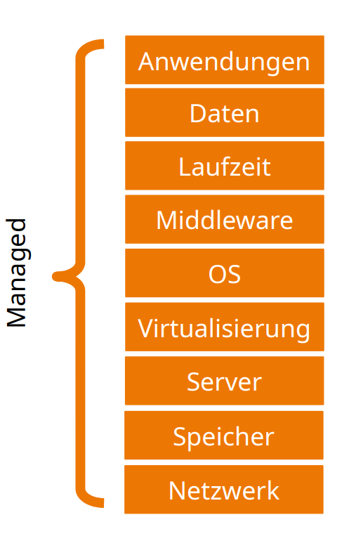
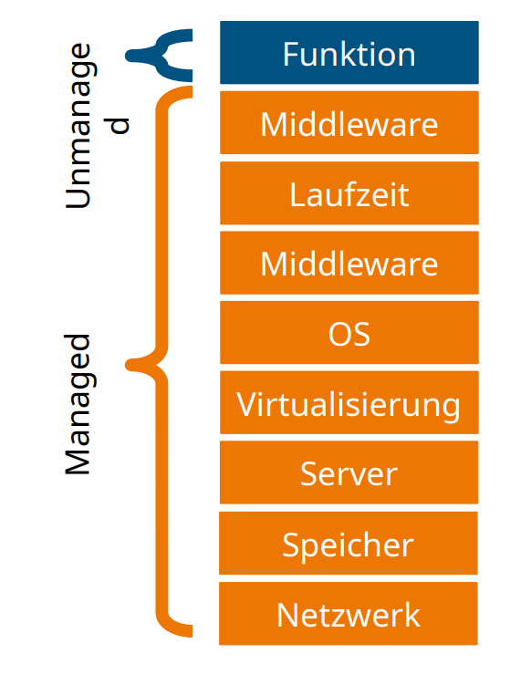

# Servicemodelle

 

## Cloud-Servicemodelle erklärt

 

Die verschiedenen Cloud-Servicemodelle bieten unterschiedliche Ebenen der Bereitstellung und Verwaltung von IT-Services. Diese Modelle lassen sich oft anhand des "Pizza-Prinzips" veranschaulichen.

 

**Das Pizza-Prinzip:**

 

| Cloud-Servicemodelle | Pizza as a Service |
|----------------------|---------------------|
| **IaaS (Infrastructure as a Service)** | Selbstgemachte Pizza aus Zutaten des Supermarkts. Du kontrollierst die Zubereitung, aber die Vorbereitung erfordert deine Mühe. |
| **PaaS (Platform as a Service)** | Pizza im Restaurant mit vorgefertigtem Teig und Auswahl an Belägen. Du gestaltest die Pizza, aber die Basis und Infrastruktur sind bereitgestellt. |
| **SaaS (Software as a Service)** | Bestellung einer fertigen Pizza beim Lieferdienst. Du nutzt die Anwendung, ohne Installation oder Wartung. |
| **FaaS (Function as a Service)** | Vorgefertigte Pizzateile, die du in deinen eigenen Pizzateig einfügst. Du fügst Geschäftslogik hinzu, die Plattform kümmert sich um den Rest. |

 

## Infrastructure as a Service (IaaS)

**Beschreibung:** IaaS bezieht sich auf die Miete von Infrastruktur, wie virtuellen Maschinen und Netzwerken. Die Verwaltung der Hardware und Ressourcen liegt in der Verantwortung des Anbieters. Physische Server werden durch den Anbieter verwaltet und gewartet. Betriebssystem und Software werden selbst verwaltet. 

**Vorteile:** Flexibilität, Skalierbarkeit, Kontrolle über Konfiguration.  

**Nachteile:** Benötigt weiterhin Management von Betriebssystemen und Anwendungen, technisches Fachwissen.

**Beispiel:** Applikationen laufen auf Virtual Private Server bei Hetzner, Nodes bei Cloudscale, Amazon E2C

## Platform as a Service (PaaS)

 

**Beschreibung:** PaaS stellt eine vorgefertigte Entwicklungsplattform bereit, auf der Entwickler Anwendungen erstellen und ausführen können. Die zugrunde liegende Infrastruktur und Wartung werden vom Anbieter übernommen. Laufzeitumgebung für Applikationen Wird durch Anbieter zur Verfügung gestellt. Applikation wird selbst verwaltet 

**Vorteile:** Schnellere Entwicklung, automatisierte Skalierung, geringerer Wartungsaufwand.  

**Nachteile:** Eingeschränkte Kontrolle über die zugrunde liegende Infrastruktur, begrenzte Anpassungsmöglichkeiten.

**Beispiel:** Applikationen laufen auf Heroku
 

## Software as a Service (SaaS)

 

**Beschreibung:** SaaS bietet vollständige Anwendungen über das Internet an. Nutzer können die Anwendungen über den Webbrowser nutzen, ohne sich um Installation oder Wartung kümmern zu müssen. Die gesamte Applikation wird zur Verfügung gestellt.

**Vorteile:** Einfacher Zugang, keine Installation erforderlich, automatische Updates.  

**Nachteile:** Begrenzte Anpassungsmöglichkeiten, Abhängigkeit vom Anbieter, Datenschutzüberlegungen.

**Beispiel:** Google Docs, Dropbox

## Function as a Service (FaaS)

**Beschreibung:** FaaS ermöglicht die Ausführung von isolierten Funktionen oder Geschäftslogik in einer Serverless-Umgebung. Entwickler fügen ihre Funktionen hinzu, ohne sich um die zugrunde liegende Infrastruktur kümmern zu müssen. Laufzeitumgebung inkl. Middleware (z.B. HTTP Server) wird zur Verfügung gestellt. Nur die eigentliche Funktion selbst wird selbst verwaltet.

**Vorteile:** Skalierbare Ausführung, Kostenoptimierung, Fokus auf Geschäftslogik.  

**Nachteile:** Beschränkungen bei Laufzeit und Umgebung, Abhängigkeit von Plattformanbietern.

**Beispiel:** Google Cloud Functions, Firebase
 

## Weitere Servicevarianten (XaaS)

 

**Beschreibung:** Neben den vier Hauptmodellen gibt es viele andere Cloud-Servicevarianten (XaaS), die spezifische Funktionen oder Dienstleistungen bieten. Diese können Datenbanken, Identitätsmanagement, Logging und mehr umfassen.  

**Beispiel:** Database as a Service (DBaaS) bietet Cloud-basierte Datenbankdienste, während Identity as a Service (IDaaS) Lösungen für Identitätsmanagement bereitstellt.

 

## Fazit

Die verschiedenen Cloud-Servicemodelle bieten Flexibilität und Effizienz bei der Bereitstellung von IT-Services. Die Wahl des Modells hängt von den Anforderungen, Fähigkeiten und Zielen eines Unternehmens ab. Es ist wichtig, offene Standards zu berücksichtigen, um einen Vendor-Lock-In zu vermeiden und die langfristige Flexibilität zu gewährleisten.

### Quellen

- eigenes bestehendes Wissen
- ChatGPT
- Ressourcen von GitLab